# FLOW — "The Last Lantern" đi qua 8 giai đoạn như thế nào

> Bản đồ thực tế của dự án mẫu theo pipeline trong [`SKILL.md`](../../SKILL.md): mỗi giai đoạn làm gì, ra file nào, chốt với người xem ở đâu.


## Chuỗi keyframe (luật match-cut)

```mermaid
flowchart LR
  K1["K1 · thành phố lúc chạng vạng"] -->|Cảnh 1| K2["K2 · đốm lửa rơi"]
  K2 -->|Cảnh 2| K3["K3 · Ember hắt xì"]
  K3 -->|Cảnh 3| K4["K4 · chạy lên đồi"]
  K4 -->|Cảnh 4| K5["K5 · ngoéo tay"]
  K5 -->|Cảnh 5| K6["K6 · trong áo khoác"]
  K6 -->|Cảnh 6| K7["K7 · cửa ánh sáng"]
  K7 -->|Cảnh 7| K8["K8 · Đèn Hoàng Gia bay lên"]
  K8 -->|Cảnh 8| K9["K9 · bình minh"]
```



8 cảnh cần 9 keyframe. Khung cuối cảnh N là khung đầu cảnh N+1, nên khi nối phim, chỗ cắt không lộ.

## Từng giai đoạn

| # | Giai đoạn | Việc đã làm trong dự án | File ra | Chốt với người xem |
|---|---|---|---|---|
| 0 | Thu thập đầu vào | ~85–90 giây → 8 cảnh · thuyết minh tiếng Anh · 16:9 | — | ✓ số cảnh, ngôn ngữ, tỷ lệ |
| 1 | Character sheets | 3 sheet 16:9: Milo, Lyra, Ember (turnaround, biểu cảm, tay, chi tiết trang phục) | `character_sheets/` | ✓ ngoại hình từng nhân vật |
| 2 | Story bible | Logline, thế giới Solmar, character lock, style lock, 8 nhịp cảnh, mô-típ nhạc | [`STORY.md`](STORY.md) | ✓ kịch bản |
| 3 | Keyframes | K1…K9, mỗi keyframe có nhân vật đều nạp sheet làm ref | `keyframes/` | ✓ từng khung |
| 4 | Mega prompts | 8 prompt: global locks + thứ tự ref + FIRST FRAME / MOTION / CAMERA / LAST FRAME / SOUND / MUSIC / VO | [`MEGA_PROMPTS.md`](MEGA_PROMPTS.md) | — |
| 5 | Generate video | Từng cảnh: sheet → khung đầu → khung cuối; kiểm on-model, continuity, tỷ lệ bằng ffprobe | `videos/` | ✓ từng clip |
| 6 | Thuyết minh | 8 câu kể chuyện đặt đầu cảnh; bản Anh + Việt | [`VO_SCRIPT.md`](VO_SCRIPT.md), `audio/` | ✓ giọng đọc |
| 7 | Dựng phim | Chuẩn hoá 1280×720, 24 fps → nối 1→8 → mix VO dưới nhạc → kiểm file cuối | `the-last-lantern.mp4` | ✓ bản cuối |

## Thứ tự nạp ref cho một cảnh (ví dụ cảnh 6)

```
1. MILO_SHEET     ← khoá nhân vật luôn đứng trước
2. LYRA_SHEET
3. EMBER_SHEET
4. K6             ← first frame
5. K7             ← last frame
+ prompt: global locks + nội dung cảnh 6
```

## Kiểm tra trước khi dựng

- [ ] Mọi clip đúng 16:9 (`ffprobe -show_entries stream=width,height`)
- [ ] Nhân vật đúng sheet ở mọi clip (tóc, áo, màu, tỷ lệ)
- [ ] Khung cuối clip N khớp khung đầu clip N+1
- [ ] Kiểm audio stream của từng clip trước khi mix (không giả định clip im lặng)
- [ ] Tổng thời lượng ≈ con số đã chốt ở Giai đoạn 0

Chi tiết từng bước: [`references/`](../../references/) · Bài học xương máu: [`10-lessons.md`](../../references/10-lessons.md)
